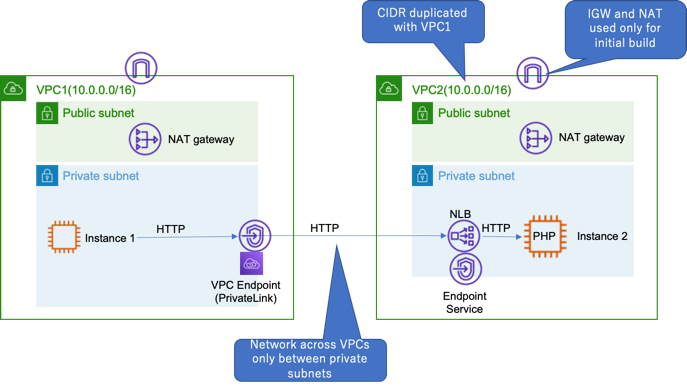

# VCP PrivateLink Demo 

This is a demo of PrivateLink. It includes demo instructions and a CloudFormation template.

- Demo1: Create My VPC Service and access the service via Priavte Link

# Demo1: Demo1: Create VPC Service and access it with Priavte Link



## How to demo

- Step1: Create a stack using Demo1-PrivateLink-vpc-service.yaml in Tokyo region
- Step2: To create private link for my custom service, do following cli command. And then copy the DnsName that is outputed 'create-vpc-endpoint' api.
  ```
  STACK_NAME=write_your_stack_name_here
  VPC1=$(aws cloudformation describe-stacks --stack-name $STACK_NAME --query 'Stacks[*].Outputs[?OutputKey==`VPC1`].OutputValue' --output text)
  PrivateSubnet1=$(aws cloudformation describe-stacks --stack-name $STACK_NAME --query 'Stacks[*].Outputs[?OutputKey==`PrivateSubnet1`].OutputValue' --output text)
  SecurityGroup1=$(aws cloudformation describe-stacks --stack-name $STACK_NAME --query 'Stacks[*].Outputs[?OutputKey==`SecurityGroup1`].OutputValue' --output text)
  VPC2EndpointServiceId=$(aws cloudformation describe-stacks --stack-name $STACK_NAME --query 'Stacks[*].Outputs[?OutputKey==`VPC2EndpointService`].OutputValue' --output text)

  VPC2EndpointServiceName=$(aws ec2 describe-vpc-endpoint-service-configurations --service-ids $VPC2EndpointServiceId --query 'ServiceConfigurations[*].ServiceName' --output text)

  aws ec2 create-vpc-endpoint --vpc-endpoint-type Interface --vpc-id $VPC1 --service-name $VPC2EndpointServiceName --subnet-ids $PrivateSubnet1 --security-group-ids $SecurityGroup1
  ```
- Step3: Access to PrivateInstance1 by using SSM Session Manager. And do following command.
  ```
  curl http://<your_vpc_endpont_dns_name>
  ```
- Step4: If you got following html, the configuration is suceeded.
  ```
  <html>
  <head><title>Hello!</title></html>
  <body>
      <h1>PrivateLink Demo</h1><br/>
      <h1>Instance ID: i-xxxxxxxxxxxxxxxx</h1>
      <h1>Local IP: 10.0.1.xx</h1>
      <p>This information has been retrieved from the Instance Metadata service.</p>
  </body>
  </html>
  ```